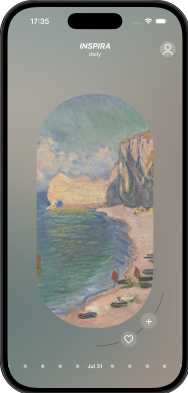
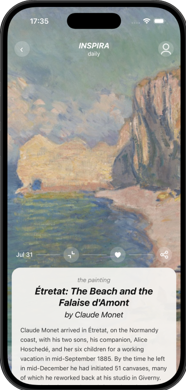

# INSPIRA daily

One painting a day, picked for you.

INSPIRA daily is a mobile app for discovering art, one piece at a time. Every day it brings you a new painting, along with the story behind it. The more you use it, the better it gets at choosing paintings you'll love.

|  |  |
|:---:|:---:|

## What you can do

- **Discover a new painting every day**, delivered at a time that suits you.
- **Learn about each work**: who painted it, when, and the story behind it.
- **Build your own collection** from the paintings you love.
- **Shape your taste** by choosing the genres and artists you're drawn to.
- **Share art** with friends or save it to your photos.
- **Keep art on your home screen** with the iOS widget.

## Made for you

When you first sign up, the app asks you to pick a few paintings that speak to you. From there, it learns your taste and keeps adapting as you like and dislike paintings, so every day's choice feels a little more personal.

## Built with

- **App:** React Native and Expo
- **Backend:** Java and Spring Boot microservices

## The art

All paintings come from the [Art Institute of Chicago](https://www.artic.edu/) open-access collection. Only public-domain works are included.
